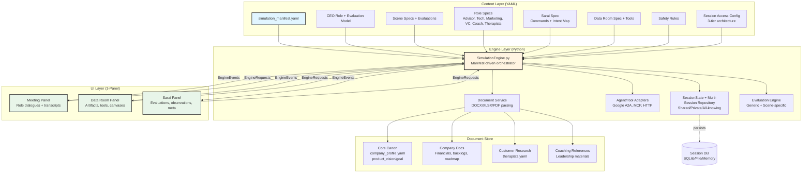
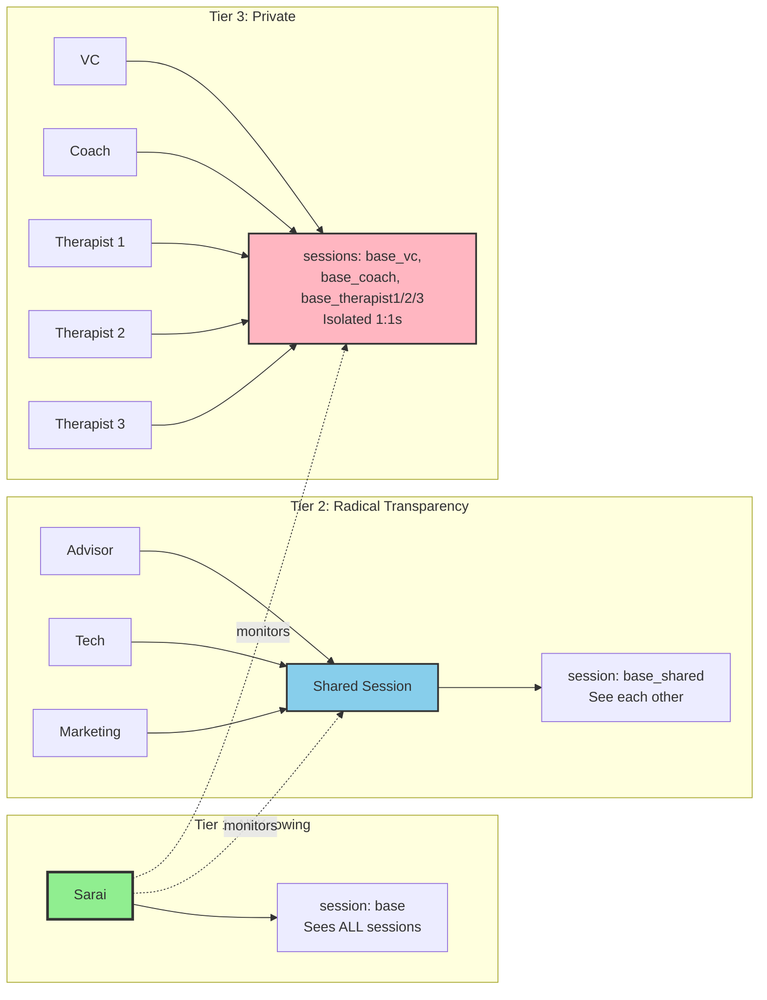

# YAML Simulator 2 - Complete Architecture

## High-Level Architecture Diagram



## Three-Tier Session Architecture



## Evaluation Model Architecture

```mermaid
graph TB
    subgraph "CEO Evaluation System"
        CEO_STATE[CEO State<br/>prompt_history<br/>commitments<br/>unlocked_docs]
        
        GENERIC[Generic CEO Evaluation<br/>5 Axes]
        SCENE[Scene-Specific Evaluation<br/>Weighted axes + criteria]
        ROLE360[Role 360 Feedback<br/>Tech/Marketing/VC/etc]
        
        CEO_STATE --> GENERIC
        CEO_STATE --> SCENE
        CEO_STATE --> ROLE360
        
        GENERIC --> SARAI_EVAL[Sarai Evaluation Output]
        SCENE --> SARAI_EVAL
        ROLE360 --> SARAI_EVAL
    end

    subgraph "Generic CEO Axes"
        AX1[Situational Awareness]
        AX2[Strategic Focus]
        AX3[Financial Discipline]
        AX4[Stakeholder Alignment]
        AX5[Decision vs Analysis]
    end

    subgraph "Scene: What Now 30-Day"
        SC1[Map Reality]
        SC2[Choose Milestone]
        SC3[Establish CEO Infrastructure]
        SC4[Declare Initial Focus]
        WEIGHTS[Weighting:<br/>Awareness: 0.3<br/>Focus: 0.3<br/>Decision: 0.2<br/>Finance: 0.1<br/>Alignment: 0.1]
    end

    subgraph "Role-Specific Feedback"
        R1[Tech: Realism about capacity]
        R2[Marketing: ICP clarity]
        R3[VC: Runway vs milestones]
        R4[Coach: Self-awareness patterns]
        R5[Advisor: Strategic depth]
    end

    GENERIC --> AX1
    GENERIC --> AX2
    GENERIC --> AX3
    GENERIC --> AX4
    GENERIC --> AX5

    SCENE --> SC1
    SCENE --> SC2
    SCENE --> SC3
    SCENE --> SC4
    SCENE --> WEIGHTS

    ROLE360 --> R1
    ROLE360 --> R2
    ROLE360 --> R3
    ROLE360 --> R4
    ROLE360 --> R5

    style SARAI_EVAL fill:#9f6,stroke:#333,stroke-width:3px
```



## Document Access by Role

| Role | Session Mode | Documents Accessible |
|------|-------------|---------------------|
| **Sarai** | all_knowing | ALL documents, ALL sessions, full transcripts, all artifacts |
| **Advisor** | radical_transparency | Core canon + ALL company docs + strategy refs + financials + roadmap |
| **Tech** | radical_transparency | Core canon + engineering docs + backlogs + tech debt + compliance |
| **Marketing** | radical_transparency | Core canon + GTM docs + website + positioning + therapist personas |
| **VC** | private | Core canon ONLY + board-level financials + high-level roadmap |
| **Coach** | private | Core canon + coaching refs + CEO evaluations (summary) + meeting summaries |
| **Therapist 1/2/3** | private | Core canon + user-facing docs ONLY |

**Core Canon (Everyone):**
- `company_profile.yaml`
- `product_vision`
- `product_goal`

## Key Features

### 1. **Manifest-Driven Content**
- All behavior defined in YAML specs
- Instructional designers can add scenes/roles without code changes
- Content versioning through manifest

### 2. **Multi-Session State Management**
- Three access tiers: all-knowing, radical transparency, private
- Session routing based on `session_access.mode` in role specs
- Parent/child session tracking for Sarai's omniscient view

### 3. **Evaluation Framework**
- Generic CEO evaluation (5 axes)
- Scene-specific evaluation with custom weighting
- Role-based 360 feedback
- Behavioral tracking (prompts, commitments, documents)

### 4. **Data Room Integration**
- Scene-specific toolkits (ICP canvas, risk register, milestone canvas)
- Artifact types: documents, graphs, kanban boards, canvases
- MCP tool integration for dynamic artifacts

### 5. **Safety & Guardrails**
- Global safety rules (`safety_rules.yaml`)
- Per-role instruction rules
- Crisis handling protocols
- Boundary enforcement

### 6. **External Integration Ready**
- Protocol-agnostic agent adapters (Google A2A, HTTP, ACP)
- MCP tool clients for Data Room automation
- Document parsing service (DOCX/XLSX/PDF → text)

## Data Flow

### Request Flow
1. UI sends `EngineRequest` with `{user_id, session_id, channel, speaker, message}`
2. Engine maps speaker → role_id
3. Engine determines session_id based on role's `session_access.mode`
4. Engine loads/creates appropriate `SessionState`
5. Engine routes to handler (Sarai command, role message, Data Room command)
6. Handler processes request, updates session state
7. Engine generates `EngineEvent`s tagged with channel
8. Engine persists session state
9. UI receives events and routes to appropriate panel

### Evaluation Flow
1. CEO interacts with roles/Sarai
2. Engine tracks prompts in `session.ceo.prompt_history`
3. CEO requests evaluation via Sarai
4. Engine runs generic evaluation (5 axes)
5. Engine runs scene-specific evaluation (weighted + criteria)
6. Engine optionally gathers role 360 feedback
7. Sarai synthesizes narrative evaluation
8. Evaluation delivered to Sarai Panel

## Implementation Status

### ✅ Completed
- YAML specs with session_access blocks
- Multi-session state management in `engine_schema.py`
- Session routing logic in `simulation_engine.py`
- Document inventory (100% spec coverage)
- Architecture documentation

### 🚧 In Progress
- Document parsing service (DOCX/XLSX/PDF)
- File-based session repository
- Scenario-specific command handlers

### 📋 Planned
- External agent adapters (Google A2A)
- MCP tool clients
- Full evaluation engine implementation
- UI implementation (3-panel client)

## File Structure

```
YAML Simulator 2/
├── mentalyc_all_specs.yaml          # Combined authoring bundle
├── yaml_splitter.py                 # Generates runtime package
├── simulation_engine.py             # Main orchestrator
├── engine_schema.py                 # Data models & interfaces
├── condensed simulation_engine.py   # Teaching version with adapters
├── SESSION_ARCHITECTURE.md          # Session tier documentation
├── ActionPlanForFirstPrototype.md   # Day-one implementation plan
├── AddingExternalAgentsorTools.md   # External integration guide
└── 3paneldesignandusage.md         # Design brief

mentalyc_sim_package_v3/             # Runtime package (generated)
├── simulation_manifest.yaml
└── specs/
    ├── ceo_role.yaml
    ├── scene_what_now.yaml
    ├── sarai_spec.yaml
    ├── dataroom_spec.yaml
    ├── dataroom_tools_scene_what_now.yaml
    ├── safety_rules.yaml
    ├── advisor_spec.yaml
    ├── tech_cofounder_spec.yaml
    ├── marketing_cofounder_spec.yaml
    ├── coach_spec.yaml
    ├── vc_spec.yaml
    └── therapist_customers_spec.yaml

Documents/assets/documents/          # Document store
├── company_profile.yaml
├── mentalyc_9_month_product_roadmap.yaml
├── therapists.yaml
├── Mentalyc_Financial_Model_vReal.xlsx
├── Mentalyc_6_Sprint_Backlog.xlsx
├── Mentalyc_Product_Vision.docx
├── website_briefing.pdf
└── [18 total documents]
```

## Next Steps

1. **Run `yaml_splitter.py`** to generate `mentalyc_sim_package_v3/`
2. **Implement document parsing** in `document_service.py`
3. **Add file-based persistence** (`FileSessionRepository`)
4. **Wire Sarai command handlers** (financial summary, evaluations, etc.)
5. **Build 3-panel UI** that consumes `EngineEvent`s
6. **Test with "Saul" scenario** from ActionPlanForFirstPrototype.md

