# Multi-Session Architecture: Three Access Tiers

This document visualizes the three-tier session access architecture implemented in the YAML Simulator 2.

## Architecture Diagram

```mermaid
graph TB
    subgraph "Tier 1: All-Knowing (Sarai Only)"
        S[Sarai<br/>session_id: base]
        S_DOCS["📚 Documents:<br/>• ALL company docs<br/>• ALL internal docs<br/>• Strategy references<br/>• Coaching references<br/>• User perspectives"]
        S_ACCESS["🔍 Session Access:<br/>• Shared session (radical transparency)<br/>• ALL private sessions (VC, Coach, Therapists)<br/>• Full meeting transcripts<br/>• All Data Room artifacts<br/>• CEO state & evaluations"]
        S --> S_DOCS
        S --> S_ACCESS
    end

    subgraph "Tier 2: Radical Transparency Team"
        SHARED[Shared Session<br/>session_id: base_shared]
        
        ADV[Advisor]
        TECH[Tech Cofounder]
        MKT[Marketing Cofounder]
        
        ADV --> SHARED
        TECH --> SHARED
        MKT --> SHARED
        
        ADV_DOCS["📚 Advisor Docs:<br/>• Core canon<br/>• ALL company docs<br/>• Strategy references<br/>• Financial model<br/>• Roadmap & sprints"]
        
        TECH_DOCS["📚 Tech Docs:<br/>• Core canon<br/>• Engineering docs<br/>• Technical debt<br/>• Compliance reqs<br/>• Product backlog"]
        
        MKT_DOCS["📚 Marketing Docs:<br/>• Core canon<br/>• GTM documentation<br/>• Website briefing<br/>• Marketing plans<br/>• Positioning materials"]
        
        ADV --> ADV_DOCS
        TECH --> TECH_DOCS
        MKT --> MKT_DOCS
        
        SHARED_STATE["💬 Shared Context:<br/>• See each other's messages<br/>• Shared meeting transcript<br/>• Collaborative discussions<br/>• Real-time transparency"]
        SHARED --> SHARED_STATE
    end

    subgraph "Tier 3: Private Sessions"
        VC_SESS[VC Session<br/>session_id: base_vc]
        COACH_SESS[Coach Session<br/>session_id: base_coach]
        T1_SESS[Therapist 1 Session<br/>session_id: base_therapist1]
        T2_SESS[Therapist 2 Session<br/>session_id: base_therapist2]
        T3_SESS[Therapist 3 Session<br/>session_id: base_therapist3]
        
        VC[VC]
        COACH[Coach]
        T1[Therapist 1]
        T2[Therapist 2]
        T3[Therapist 3]
        
        VC --> VC_SESS
        COACH --> COACH_SESS
        T1 --> T1_SESS
        T2 --> T2_SESS
        T3 --> T3_SESS
        
        VC_DOCS["📚 VC Docs:<br/>• Core canon ONLY<br/>• Financial summary (board-level)<br/>• High-level milestones<br/>• Risk memos<br/><br/>❌ NO internal docs<br/>❌ NO team discussions"]
        
        COACH_DOCS["📚 Coach Docs:<br/>• Core canon<br/>• Coaching references<br/>• Leadership frameworks<br/>• CEO evaluations (summary)<br/><br/>❌ NO company internals<br/>❌ NO financial details"]
        
        THER_DOCS["📚 Therapist Docs:<br/>• Core canon<br/>• User-facing docs<br/>• Product vision<br/><br/>❌ NO internal docs<br/>❌ NO financials<br/>❌ NO roadmaps"]
        
        VC --> VC_DOCS
        COACH --> COACH_DOCS
        T1 --> THER_DOCS
        T2 --> THER_DOCS
        T3 --> THER_DOCS
        
        PRIVATE_STATE["🔒 Private Context:<br/>• Only see CEO's direct messages<br/>• Isolated conversations<br/>• No team visibility<br/>• 1:1 confidentiality"]
        
        VC_SESS --> PRIVATE_STATE
        COACH_SESS --> PRIVATE_STATE
        T1_SESS --> PRIVATE_STATE
        T2_SESS --> PRIVATE_STATE
        T3_SESS --> PRIVATE_STATE
    end
    
    S -.->|can see| SHARED
    S -.->|can see| VC_SESS
    S -.->|can see| COACH_SESS
    S -.->|can see| T1_SESS
    S -.->|can see| T2_SESS
    S -.->|can see| T3_SESS

    style S fill:#9f6,stroke:#333,stroke-width:4px
    style SHARED fill:#69f,stroke:#333,stroke-width:2px
    style VC_SESS fill:#f96,stroke:#333,stroke-width:2px
    style COACH_SESS fill:#f96,stroke:#333,stroke-width:2px
    style T1_SESS fill:#f96,stroke:#333,stroke-width:2px
    style T2_SESS fill:#f96,stroke:#333,stroke-width:2px
    style T3_SESS fill:#f96,stroke:#333,stroke-width:2px
```

## Core Canon (Everyone Sees)

All agents have access to these foundational documents:
- `company_profile.yaml` - Mentalyc context: stage, team, product, runway, market
- `product_vision` - High-level aspiration for Mentalyc's product
- `product_goal` - Near-term product goals/outcomes

## Session Routing Logic

When a message comes in, the engine:

1. **Identifies the speaker** → maps to `role_id`
2. **Looks up session_access.mode** from role spec
3. **Routes to appropriate session_id**:
   - `all_knowing` (Sarai) → `{base_session_id}` (can see all others)
   - `radical_transparency` → `{base_session_id}_shared`
   - `private` → `{base_session_id}_{role_suffix}`

## Example Session IDs

For user `saul` with base session `session-001`:

| Role | Session ID | Mode |
|------|-----------|------|
| Sarai | `session-001` | all_knowing |
| Advisor | `session-001_shared` | radical_transparency |
| Tech Cofounder | `session-001_shared` | radical_transparency |
| Marketing Cofounder | `session-001_shared` | radical_transparency |
| VC | `session-001_vc` | private |
| Coach | `session-001_coach` | private |
| Therapist 1 | `session-001_therapist1` | private |
| Therapist 2 | `session-001_therapist2` | private |
| Therapist 3 | `session-001_therapist3` | private |

## Benefits

✅ **Radical transparency where it matters** - Core team (Advisor, Tech, Marketing) collaborate openly  
✅ **Privacy where needed** - VC, Coach, Therapists have confidential 1:1s  
✅ **Meta-orchestration** - Sarai sees everything to provide holistic guidance  
✅ **YAML-configured** - No code changes needed to adjust access tiers  
✅ **Document access aligned** - Session isolation matches document permissions  

## Implementation Files

- `mentalyc_all_specs.yaml` - Role specs with `session_access` blocks
- `engine_schema.py` - `SessionState` with multi-session support
- `simulation_engine.py` - Session routing logic based on access mode

